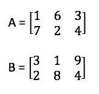

# Machine Learning Lab 2 - Linear Algebra

Here, have a bit of practice with linear algebra to compound what we went through in the lecture :wink:

### 1.1 - Vectors

Consider the following two vectors
```
v = [100, 200, 300, 400, 500]
w = [-100, -100, -100, -100, -100]
```

**QUESTION 1.1.1**: how many **dimensions** does vector v have?

**QUESTION 1.1.2**: what's the value of element v<sup>(3)</sup> assuming this as a 1-indexed vector?

**QUESTION 1.1.3**: what's the resulting vector if you multiply v with a scalar value 3?

**QUESTION 1.1.4**: what's the resulting vector if you add vector w to vector v?


### 1.2 - Matrices

A bit of practice with matrices just to compound what we went through in the lecture.

Consider the following matrices



**QUESTION 1.2.1**: what's the value of element A<sub>(12)</sub>?

**QUESTION 1.2.2**: what's the value of element B<sub>(32)</sub>?

**QUESTION 1.2.3**: A + B = ?

**QUESTION 1.2.4**: 3 x A = ?

**QUESTION 1.2.5**: B / 2 = ?


### 1.3 - Sets

A bit of practice with sets just to compound what we went through in the lecture.

**QUESTION 1.3.1**: what values exist in 𝒮 = [1, 5] ?

**QUESTION 1.3.2**: given 𝒮 = [1, 5], and 𝑥 = 3, is 𝑥 ∈ 𝒮 true?

Consider the following sets

   𝒮<sub>1</sub> = {10, 20, 30}

   𝒮<sub>2</sub> = {5, 10, 15, 20, 25, 30}

**QUESTION 1.3.3**: 𝒮<sub>1</sub> ∩ 𝒮<sub>2</sub> = ?

**QUESTION 1.3.4**: 𝒮<sub>1</sub> ∪ 𝒮<sub>2</sub> = ?
